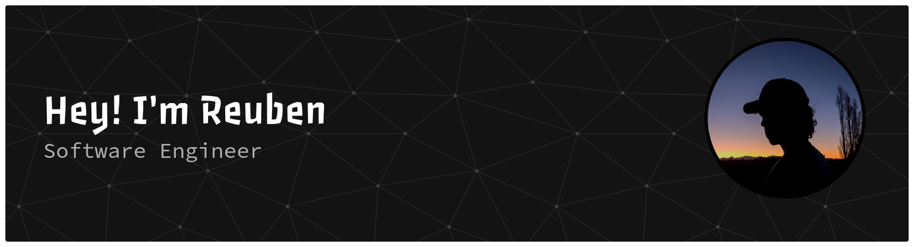

  
  
  

###

I'm a third year software engineering student studying at the University of Canterbury in **New Zealand**.
- I am currently updating my portfolio site with react.

###

<h3 align="left">I work with</h3>

###

  
  
  
  
  
  
  
  
  
  
  
  
  
  
  

###

<h3 align="left">Stats</h3>

###

  

###
